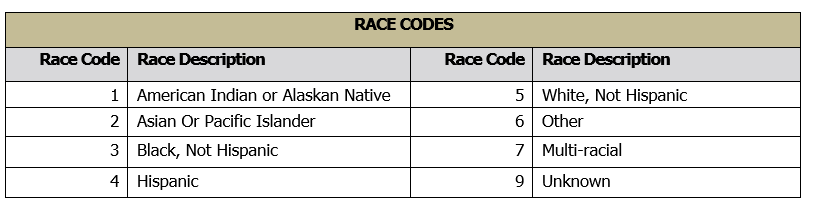

### Evaluating Ethnicolr

We evaluate some of the [ethnicolr models](https://github.com/appeler/ethnicolr) on the [NC Voter Registration Data](https://dataverse.harvard.edu/dataset.xhtml?persistentId=doi:10.7910/DVN/NEFUBN) (access limited to researchers with university affiliation). There are some challenges in evaluation given how race and ethnicity are coded varies across the two states.

### Measuring Race and Ethnicity

North Carolina distinguishes between race and ethnicity and has two columns. Here's the codebook:

```
/ ***************************************************************************
Race codes
race               description
*******************************************************************************
A                  ASIAN
B                  BLACK or AFRICAN AMERICAN
I                  AMERICAN INDIAN or ALASKA NATIVE
M                  TWO or MORE RACES
O                  OTHER
P                  NATIVE HAWAIIAN or PACIFIC ISLANDER
U                  UNDESIGNATED
W                  WHITE
*************************************************************************** /

/ ***************************************************************************
Ethnic codes
ethnicity          description
*******************************************************************************
HL                 HISPANIC or LATINO
NL                 NOT HISPANIC or NOT LATINO
UN                 UNDESIGNATED
*************************************************************************** /
```

FL codebook is as follows:



### Analyses

We start by presenting a full cross-tabulation of prediction from the FL full name model and NC concatenation of race and ethnicity, e.g., Asian--HL, Asian--NL, etc.

Next we present three comparisons:

Comparison # 1: Clean Commensurate Group
--------------------------

(race_code == 'B') & (ethnic_code == 'NL') ==> nh_black
(race_code == 'W') & (ethnic_code == 'NL') ==> nh_white

The overall accuracy is 82%, with accuracy for NH Black at 33% and NH White at 96%.

Comparison #2: Low FP
------------------------

1. (race_code == 'B') & (ethnic_code == 'NL') ==> nh_black
2. (race_code == 'W') & (ethnic_code == 'NL') ==> nh_white
3. ((race_code == 'W') & (ethnic_code == 'HL')) | ((race_code == 'B') & (ethnic_code == 'HL')) ==> hispanic
4. (race_code == 'A') & (ethnic_code == 'NL') ==> asian

The overall accuracy is 81%, with accuracy for NH Black at 33%, NH White at 96%, Asians at 60%, and Hispanics at 59%.

Comparison #3: Low FN
-----------------------

1. (race_code == 'B') & (ethnic_code == 'NL') ==> nh_black
2. (race_code == 'W') & (ethnic_code == 'NL') ==> nh_white
3. ethnic_code == 'HL' ==> hispanic
4. (race_code == 'A')  & (ethnic_code == 'NL') ==> asian

The overall accuracy is 81%, with accuracy for NH Black at 33%, NH White at 96%, Asians at 60%, and Hispanics at 71%.

### NC Ethnicolr Model(s)

We build new LSTM models based on NC data. We start by assuming y = concatenation of ethnic code and race code. We remove U and also UN --- assuming they are 'missing at random.' This gives us 12 categories.

We build a separate model that only predicts the race_code and takes out 'U', again assuming it to be 'missing at random.' We also build a model that only predicts ethnic_code and take out the UN.

### Scripts

1. [Download NC Data](scripts/01_download_nc_voter.ipynb)
2. [FL Model Evaluation on NC Data](scripts/02_analyze_nc_voter.ipynb)
3. [12 category Model](scripts/03_nc_12_cat_model.ipynb)
4. [Race code model](scripts/04_nc_race_code.ipynb)
5. [Latino model](scripts/05_nc_voter_name_lstm_hispanic.ipynb)
6. [NC Model Evaluation on FL Data](scripts/06_analyze_fl_analyze.ipynb)

### Authors

Suriyan Laohaprapanon and Gaurav Sood
